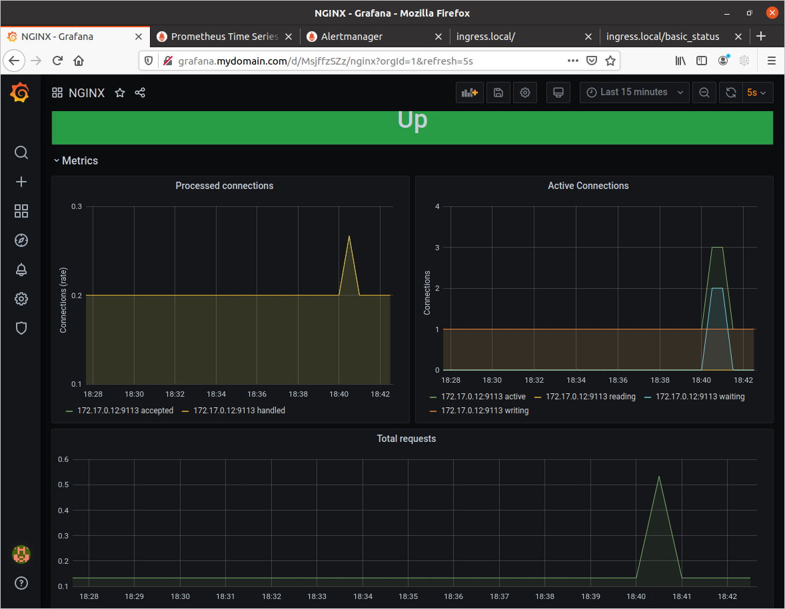
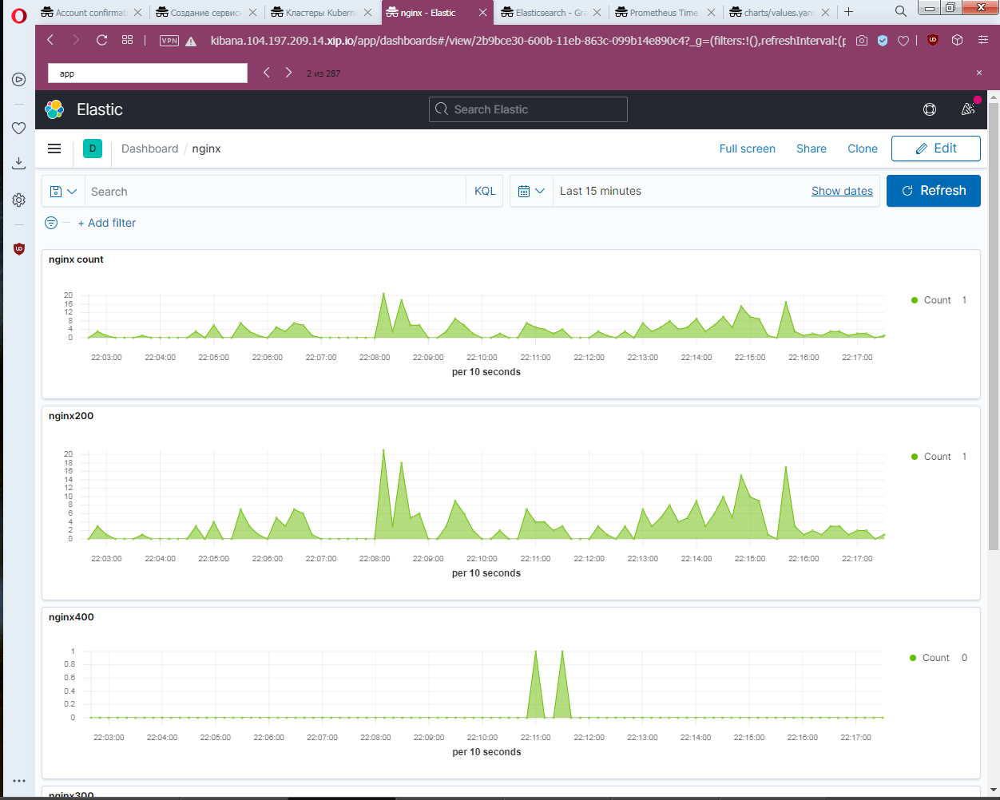
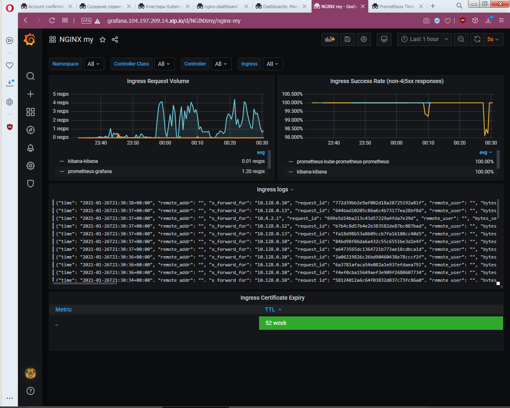
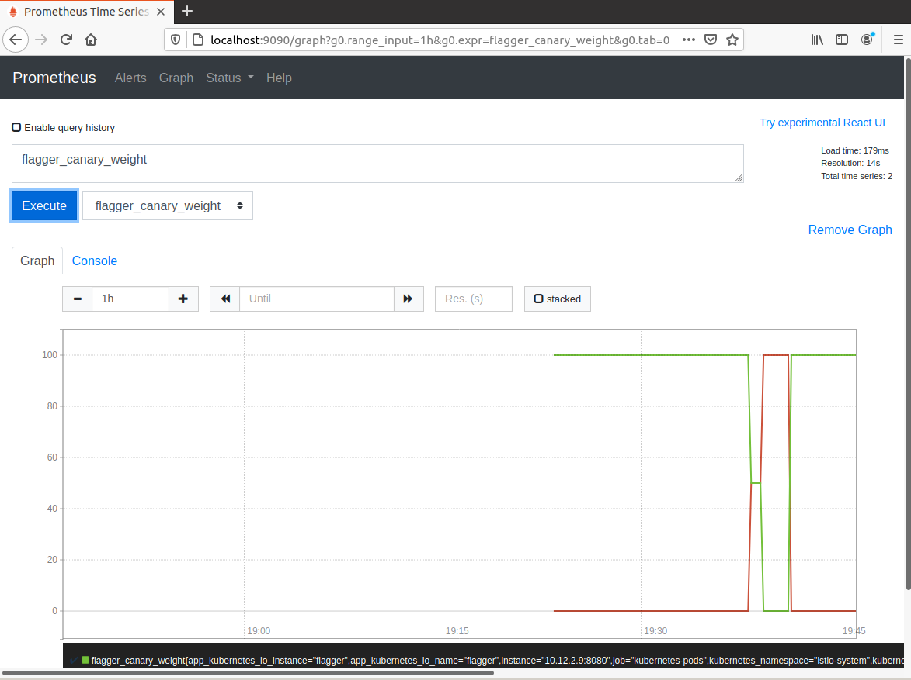

# IsieIam_platform
IsieIam Platform repository

<details>
<summary>Домашнее задание к лекции №2 (Знакомство с Kubernetes, основные понятия и архитектура)
</summary>

### Предзадание:
 - создана ветка kubernetes-prepare, в ней:
 - добавлен .travis.yml
 - добавлен шаблон для описания PR
 - добавлен .github/auto_assign.yml
 - создан PR к ветке main

### Задание:
 - установлен minikube (sudo -E minikube start --driver=none)
 - minikube ssh для выбранного способа старта не работает, т.к. vm как таковой нет, в вышестоящем запуске миникуб запускается в docker
 - установлен k8s dashboard и k9s

```
Для получения token для dashboard использовать:
kubectl get secrets -n kubernetes-dashboard
kubectl describe secret kubernetes-dashboard-token-**** -n kubernetes-dashboard
```

 - Проверено удаление системных подов: выжили не все - storage-provisioner сгинул навсегда.

```
coredns-f9fd979d6-48jsj - контролируется replica-set
kube-proxy-c4zf9 - контролируется DaemonSet/kube-proxy
Остальные поды контролируются - Node/isie-virtualbox, они являются static pods и контролируются kubelet, доп инфо тут:
  https://kubernetes.io/docs/tasks/configure-pod-container/static-pod/
их yml хранятся в /etc/kubernetes/manifest/
```

 - Создан dockerfile для запуска nginx, в него помещен измененный дефолтный конфиг и простой homework.html для тестов.
 - В dockerfile добавлены команды для запуска nginx от пользователя с uid 1001, самого nginx на 8000 порту и root каталогом /app
 - Собран и запушен в hub.docker.com образ.

```
для сборки и пуша использовать:
sudo docker build -t isieiam/nginx-test:1.0 .
sudo docker push isieiam/nginx-test:1.0
```

 - Написан web-pod.yaml и применен в миникуб

```
для установки пода из файла:
kubectl apply -f web-pod.yaml
для получения yaml пода:
kubectl get pod web -o yaml
альтернативно - вывод описания пода
kubectl describe pod web
```

 - Добавлен к под-у web init контейнер, который скачивает статику с https://tinyurl.com/otus-k8s-intro и которое через volume попадает к nginx в его рутовую директорию.

```
для проверки и проброса порта наружу:
kubectl port-forward --address 0.0.0.0 pod/web 8000:8000
```

 - Hipster-shop - склонирован репо, собран и запушен в hub.docker.com frontend

```
для сборки и пуша фронта:
sudo docker build -t isieiam/hipster-front:1.0 .
sudo docker push isieiam/hipster-front:1.0
генерация манифестов средствами kubectl:
kubectl run frontend --image isieiam/hipster-front:1.0 --restart=Never --dry-run=true -o yaml > frontend-pod.yaml
```

### Задание со *:

> Выясните причину, по которой pod frontend находится в статусе Error

Причина в том что он не может найти переменные окружения:

```
panic: environment variable "PRODUCT_CATALOG_SERVICE_ADDR" not set
```

> Создайте новый манифест frontend-pod-healthy.yaml...В результате, после применения исправленного манифеста pod frontend должен находиться в статусе Running...Поместите исправленный манифест frontend-pod-healthy.yaml в директорию kubernetes-intro

Добавлены переменные окружения из https://github.com/GoogleCloudPlatform/microservices-demo/blob/master/kubernetes-manifests/frontend.yaml. 
Создан frontend-pod-healthy.yaml - в результате под запускается - все ок.

</details>

<details>
<summary>Домашнее задание к лекции №3 (Механика запуска и взаимодействия контейнеров в Kubernetes)
</summary>

### Задание:
- Развернут кластер через kind
- Проверено создание на практике replica-set
- Проверена на практике работа с deployment
- Проверено на практике использование probes
- Развернут node-exporter через daemonset на всех нодах кластера, включая master

> Руководствуясь материалами лекции опишите произошедшую ситуацию, почему обновление ReplicaSet не повлекло обновление запущенных pod? 

ответ из лекции: потому что ReplicationController "НЕ проверяет соответствие запущенных Podов шаблону"

- Вспомогательные команды:

```
- получить поды по метке:
kubectl get pods -l app=frontend
- получить реплики:
kubectl get rs
- масштабирование реплики
kubectl scale replicaset frontend --replicas=3
- отследить развертывание реплики по метке:
kubectl apply -f frontend-replicaset.yaml | kubectl get pods -l app=frontend -w
- откат deployment-a:
kubectl rollout undo deployment paymentservice --to-revision=1 | kubectl get rs -l app=paymentservice -w
```

### Задание со * №1:

> С использованием параметров maxSurge и maxUnavailable самостоятельно реализуйте два следующих сценария развертывания:

```
Аналог blue-green:
1. Развертывание трех новых pod
2. Удаление трех старых pod
Reverse Rolling Update:
1. Удаление одного старого pod
2. Создание одного нового pod
```

Созданы:
- paymentservice-deployment-bg.yaml
- paymentservice-deployment-reverse.yaml

### Задание со * №2:

> Найдите в интернете или напишите самостоятельно манифест node-exporter-daemonset.yaml для развертывания DaemonSet с Node Exporter

- в инете найдено здесь https://github.com/shevyf/prom_on_k8s_howto/blob/master/node-exporter-daemonset.yml
- актуализировано под текущую версию api и убраны некоторые навороты - см node-exporter-daemonset.yaml
- метрики собираются

### Задание со **:

>Найдите способ модернизировать свой DaemonSet таким образом, чтобы Node Exporter был развернут как на master, так и на worker нодах (конфигурацию самих нод изменять нельзя)

Пример можно найти в мануале: https://kubernetes.io/docs/concepts/workloads/controllers/daemonset/

```
tolerations: # this toleration is to have the daemonset runnable on master nodes remove it if your masters can't run pods
  - key: node-role.kubernetes.io/master
    effect: NoSchedule
```

Параметр добавлен в node-exporter-daemonset.yaml

</details>

<details>
<summary>Домашнее задание к лекции №4 (Безопасность и управление доступом)
</summary>

### Задание:

- Изучено https://kubernetes.io/docs/reference/access-authn-authz/rbac/
- сделаны задания:

#### Задание №1
- Создать Service Account bob, дать ему роль admin в рамках всего кластера
- Создать Service Account dave без доступа к кластеру

#### Задание №2
- Создать Namespace prometheus
- Создать Service Account carol в этом Namespace
- Дать всем Service Account в Namespace prometheus возможность делать get, list, watch в отношении Pods всего кластера

#### Задание №3
- Создать Namespace dev
- Создать Service Account jane в Namespace dev
- Дать jane роль admin в рамках Namespace dev
- Создать Service Account ken в Namespace dev
- Дать ken роль view в рамках Namespace dev

#### Шпаргалка:
- ClusterRole не принадлежит ни одному namespace
- ClusterRole - роль на весь кластер
- Role - роль только на неймспейс
- И с ролями надо внимательно - могут существовать одноименные роли на кластер и в неймспейсе
- FAQ по биндингу:

```
apiVersion: rbac.authorization.k8s.io/v1
# Этот биндинг дает ползователю "jane" роль pod-reader  в "default" неймспейсе
# Роль  "pod-reader" должна в этом неймспейсе существовать.
kind: RoleBinding
metadata:
  name: read-pods    # придумываем название биндингу
  namespace: default # создаем биндинг именно в default
subjects:            # кому даем права
                     # можно указать нескользо "subject"
- kind: User
  name: jane         # имя пользователя регистрозависимое
  apiGroup: rbac.authorization.k8s.io
roleRef:             # указываем одну роль которую дадим верхним пользователям или сервисаккаунтам
  kind: Role         # либо  Role, либо ClusterRole
  name: pod-reader   # должно быть имя существующей Role или ClusterRole
  apiGroup: rbac.authorization.k8s.io
```

</details>

<details>
<summary>Домашнее задание к лекции №5 (Сетевая подсистема Kubernetes)
</summary>

### Задание:

- ветка kubernets-network, рабочий каталог kubernetes-network
- добавлены и проверена работоспособность readinessProbe и livenessProbe в web-pod.yml
- создан deployment под наше приложение web, добавлена strategy, с параметрами maxSurge и maxUnavailable есть пример в прошлой Д/З в задании с *
- изучены service c clusterip, а также наложение его создания на iptables
- переключен kube-proxy на ipvs, установлен и настроен metallb, изучено применение service loadbalancer

```
Для получения прямого доступа с локальной машины до сервисов
узнаем ip minikube: minikube ip (192.168.49.2)
при создании указывали подсетку для ext адресов или смотрим ext адрес у нужного нам сервиса 
и дальше прописываем маршрут на локальной машине для доступа к сервисам ip route add 172.17.255.0/24 via 192.168.49.2

Альтернативно можно пробрасывать любые порты на сущности вида pod, deployment, service:
kubectl port-forward service/web-svc-lb 5555:5555
kubectl port-forward deployment/web 5555:8000
```

- Установлен Ingress-COntroller в виде nginx с использованием metallb (никогда так делать больше не буду, чет слишком сложно)
- Создан headless сервис и ingress для нашего сервиса (web-svc-headless.yaml, web-ingress.yaml )


### Самопроверка:

>Вопрос для самопроверки:
>1. Почему следующая конфигурация валидна, но не имеет смысла?

```
livenessProbe:
 exec:
 command:
 - 'sh'
 - '-c'
 - 'ps aux | grep my_web_server_process'
```

С точки зрения проверки работоспопобсноти сайта - наличие процесса веб-сервера не гарантирует работоспособность сайта.
Grep: the grep manual at the exit status section report: EXIT STATUS The exit status is 0 if selected lines are found, and 1 if not found.
Т.е. grep вернет 0 если процесс есть и не 1 если его нет.

>2. Бывают ли ситуации, когда она все-таки имеет смысл?

Бывают - например когда у нас какое-нибудь легаси приложение или когда в одном контейнере надо мониторить допустим два процесса(entrypoint отвечает за основное), а liveness смотрит допустим на второе и падение второго тоже критично.

### Задание со * №1:

> 1. Сделайте сервис LoadBalancer , который откроет доступ к CoreDNS снаружи кластера (позволит получать записи через внешний IP). Например, nslookup web.default.cluster.local 172.17.255.10 .
> 2. Поскольку DNS работает по TCP и UDP протоколам - учтите это в конфигурации. Оба протокола должны работать по одному и тому же IPадресу балансировщика.
> 3. Полученные манифесты положите в подкаталог ./coredns

Релизовано, см ./kubernetes-network/ext-coredns-svc.yaml

Правда есть момент - сам сервис позволяет резолвить как имена так и обратный просмотр, но что интересно, у меня имена резолвились только в виде ip_address.web.default.cluster.local, почему они так генерились непонятно.

Подсказка: см https://metallb.universe.tf/usage/#ip-address-sharing

### Задание со * №2: Ingress для Dashboard

> Добавьте доступ к kubernetes-dashboard через наш Ingress-прокси:
> 1. Cервис должен быть доступен через префикс /dashboard ).
> 2. Kubernetes Dashboard должен быть развернут из официального манифеста. Актуальная ссылка есть в .
> 3. Написанные вами манифесты положите в подкаталог ./dashboard

Установлен kubernetes-dashboard: https://github.com/kubernetes/dashboard

```
kubectl apply -f https://raw.githubusercontent.com/kubernetes/dashboard/v2.1.0/aio/deploy/recommended.yaml
```

Написан манифест: ./kubernetes-network/dashboard/dashboard-ingress.yaml Проверена работоспособность - все ок.

Для выковыривания токена можно использовать, подставив нужное имя пода: 

```
kubectl describe secret kubernetes-dashboard-token-t5qnb -n kubernetes-dashboard
```

### Задание со * №3: Canary для Ingress

> Перенаправление части трафика на выделенную группу подов должно происходить по HTTP-заголовку.
> Естественно, что вам понадобятся 1-2 "канареечных" пода. 
> Написанные манифесты положите в подкаталог ./canary

В каталоге ./kubernetes-network/canary созданы два типа файлов: deployment, service, ingress для main приложения и для canary.

Выполняем kubectl apply -f ./ в каталоге canary. В реузльтате получаем два приложения.

Основной интерес представляе web-ingress-canary.yaml - в нем задаются основные параметры канарейки:

```
    nginx.ingress.kubernetes.io/canary: "true"                  # включает режим канарейки для nginx для нашего правила
    nginx.ingress.kubernetes.io/canary-by-header: "canary"      # вариант №1: задаем header имя по которому будем проверять идти нам в канарейку или нет
    nginx.ingress.kubernetes.io/canary-by-header-value: "true"  #             задаем header значение
    #nginx.ingress.kubernetes.io/canary-weight: "50"            # вариант №2: задаем в % соотношении запросов между промом и канарейкой кого и ск-ко - не совместимо с вариантом №1
```

Проверить что canary работает, т.е. на него идет трафик для нашего приложения - можно на выводе index.html по host name - там будет имя пода: main для основного приложения, canary для канарейки.

Подробности по настройке можно найти тут: https://github.com/kubernetes/ingress-nginx/blob/master/docs/user-guide/nginx-configuration/annotations.md#canary

### Доп инфо:

- на 20 версии кубера и докера заработало minikube ssh
- для запуска minikube: minikube start --vm-driver=docker  (причем по дефолту теперь оно запускается с vm в виде docker)
- Остановка: minikube stop
- Удаление кластера: minikube delete
- Установка дашборда: minikube dashboard
- Установка ингресса: minikube addons enable ingress
- Получение адреса minikube: minikube ip

</details>

<details>
<summary>Домашнее задание к лекции №6 (Хранение данных в Kubernetes: Volumes, Storages, Statefull-приложения)
</summary>

### Задание:

- Запущен кластен через kind
- Установлен MinIO (https://min.io) statefulset и service с использованием их манифестов:

```
kubectl apply -f https://raw.githubusercontent.com/express42/otus-platformsnippets/master/Module-02/Kuberenetes-volumes/minio-statefulset.yaml
kubectl apply -f https://raw.githubusercontent.com/express42/otus-platformsnippets/master/Module-02/Kuberenetes-volumes/minio-headless-service.yaml
```

- Манифесты сохранены в каталог: ./kubernetes-volumes
- Замучаны pv и pvc в разных способах создания и удаления, а также применения политик.
- Изучено как это хранится на диске с учетом stadard плагина kind и minikube
- Для запуска minio можно использовать: kubectl port-forward statefulsets/minio 9000:9000
- Опробовано использование самого minio
- На будущее есть некая то ли фича, то ли баг(по крайней мере офф документации k8s поведение явно противоречит, то это же плагин :) ):

>Интересный момент поймал на kind(да и minikube также ведет себя) с volume(домашка с minio): 
>если попытаться удалить PV(policy deleted) при существующем PVC, PV перейдет в terminated 
>как описано например тут https://kubernetes.io/docs/concepts/storage/persistent-volumes/#storage-object-in-use-protection), 
>но когда удалить PVC после этого, PV удалится, но данные по факту останутся в каталоге докера(в volumes) несмотря на политику. 
>Если же удалить изначально PVC, то и PV и данные удалятся(считаем что сам ss minio во всех случаях уже убит).  

### Задание со *

>В конфигурации нашего StatefulSet данные указаны в открытом виде, что не безопасно.
> Поместите данные в и настройте конфигурацию на их использование.

Написан манифест для secret. Сами secret закодированы base64. В существующие манифест statefulset добавлено использование secret.

</details>


<details>
<summary>Домашнее задание к лекции №7 (Шаблонизация манифестов. Helm и его аналоги (Jsonnet, Kustomize))
</summary>

### Задание:

- В этом задании есть небольшая инструкция по google cloud platform.(само облако осталось с прошлого курса)
- Создан k8s в GCP
- Обновлен helm3 до актуальной версии.

```
т.к. часть версий helm чартов из старого репа, то обзовем:
старые: helm repo add stable-old https://charts.helm.sh/stable
новые:  helm repo add stable https://kubernetes-charts.storage.googleapis.com
```

- Установлен nginx ingress через helm:

```
kubectl create ns nginx-ingress
helm upgrade --install nginx-ingress stable-old/nginx-ingress --wait \
 --namespace=nginx-ingress \
 --version=1.41.3
```

- Установлен cert manager через helm:

```
kubectl create namespace cert-manager
# ставим дополнения:
kubectl apply -f https://github.com/jetstack/cert-manager/releases/download/v1.1.0/cert-manager.crds.yaml -n cert-manager
# ставим сам менеджер
helm install cert-manager jetstack/cert-manager --namespace cert-manager --version v1.1.0
# доп инфо:
https://habr.com/ru/company/flant/blog/496936/
```

- Установлены clusterissures для автоматической выдачи сертификатов используя let's encrypt - см kubernetes-templating/cert-manager. Один файл для прода(реальный сертификат), второй для stage(фейковый сертификат от LE)

```
Для использования потом в ингрессе этих issuer необходимо добавить аннотации и секрет - как на примере ниже(в секрет поместится полученный сертификат):
  tls:
    enabled: true
    secretName: "harbor.35.192.45.27.nip.io"
    #secretName: ""
  ingress:
    hosts:
      core: harbor.35.192.45.27.nip.io
    annotations:
      kubernetes.io/ingress.class: nginx
      kubernetes.io/tls-acme: "true"
      cert-manager.io/cluster-issuer: "letsencrypt-production"
      cert-manager.io/acme-challenge-type: http01
```

- Установлен chartmuseum, на нем проверена корректная выдача сертификата - все ок.

```
kubectl create ns chartmuseum
helm upgrade --install chartmuseum stable-old/chartmuseum --wait \
 --namespace=chartmuseum \
 --version=2.13.2 \
 -f kubernetes-templating/chartmuseum/values.yaml

helm ls -n chartmuseum
```

### Задание со * №1: chartmuseum

>Научитесь работать с chartmuseum
>Опишите в PR последовательность действий, необходимых для добавления туда helm chart's и их установки с использованием chartmuseum как репозитория

Набор команд для использования chartmuseum ниже, вспомогательные ссылки: 
- https://chartmuseum.com/docs/#uploading-a-chart-package
- https://stackoverflow.com/questions/48577211/fail-to-upload-chart-to-chartmuseum

Тренироваться будем на чартах реддита с прошлых заданий:

```
# Для начала ставим плагин позволяющий пушить в какой-либо хелм репо:
helm plugin install https://github.com/chartmuseum/helm-push.git
# создаем пакет чарта (на выходе получим архив такой же как и при сборе зависимостей)
helm package .
# добавляем музей как репо для хелма:
helm repo add my-chartmuseum https://chartmuseum.34.68.65.51.nip.io
# пушим
helm push reddit/ my-chartmuseum
# обновляем:
helm repo update
# проверяем:
helm search repo reddit
NAME                 	CHART VERSION	APP VERSION	DESCRIPTION                   
my-chartmuseum/reddit	0.1.0        	           	OTUS sample reddit application
# и при необходимости можно поставить:
helm upgrade --install reddit my-chartmuseum/reddit
```

### Самостоятельное задание  №1: harbor

- Добавляем репо: helm repo add harbor https://helm.goharbor.io
- Создаем namespace: kubectl create ns harbor
- Устанавливаем, перед этим подготовив кастомные переменные:

```
helm upgrade --install harbor harbor/harbor --wait \
 --namespace=harbor \
 -f kubernetes-templating/harbor/values.yaml
```

- Реквизиты по умолчанию - admin/Harbor12345
- Был какой непонятный глюк что сервис не пускал себя с паролем при включенном tls, спустя неделю при тех же настройках все запустилось.

### Задание со * №2: Используем helmfile

> Опишите установку nginx-ingress, cert-manager и harbor в helmfile
> Приложите получившийся helmfile.yaml и другие файлы (при их наличии) в директорию kubernetes-templating/helmfile

- Написан файл: kubernetes-templating/helmfile/helmfile.yaml
- Для установки богатства из файла достаточно использовать helmfile sync в каталоге с файлом, единственно потом придется запустить повторно проставив корректный ext-ip ингресса(т.к. используется внешний сервис для генерации dns по ip).
- Есть момент: если существуют какие-то одноименные ресурсы оно выдаст ошибку и не поставится (например crd от cred-manager), но это справедливо и для любой установки любого чарта к существующим ресурсам в k8s.


### Задание: Создаем свой helm chart

- создан helm-chart для hipster-shop, запущен, работает(для gcp чтобы пробросить nodeport - надо зайти в gui найти сервис и там будет команда для forwarding).
- вынесен frontend в отдельный чарт - проверена работоспособность через  ingress - все ок.
- параметризован чарт frontend и добавлен в зависимости к основному чарту hipster-shop (не забываем, что из чарта HS фронтенд удален)
- Шпаргалка:

```
# создаем namespace для магазина:
kubectl create ns hipster-shop
# основная команда helm для разворачивания:
helm upgrade --install hipster-shop kubernetes-templating/hipster-shop --namespace hipster-shop
# обновить зависимости для чарта:
helm dep update kubernetes-templating/hipster-shop
# ставим чарт с переопределением входных значений (в данном случае они же и являются дефолтными :))
helm upgrade --install frontend kubernetes-templating/frontend --namespace hipster-shop -f kubernetes-templating/frontend/values.yaml
# удалить релиз:
helm delete frontend --namespace hipster-shop
```

### Задание со * №3: 

>Выберите сервисы, которые можно установить как зависимости, используя community chart's. Например, это может быть Redis.

- Вынесен redis из чарта hipster-shop и переведен на community чарт - в файле chart.yaml указана зависимость на внешний чарт с redis.
- добавлены доп переменные для redis(для упрощения запуска) и для сервиса cartservice(параметризован адрес redis) - см kubernetes-templating/hipster-shop/values.yaml
- удален deployment и service от redis из основного файла hipster-shop
- проверена работоспособность - все ок.

### Необязательное задание: Работа с helm-secrets

плагин переехал на новое место, то ставим плагин для секретов: 

```
helm plugin install https://github.com/jkroepke/helm-secrets
```

Инструкция по подготовке и шифрованию секретов:

```
генерим ключ:
gpg --full-generate-key
спросит пароль на закрытый и будет храиться где-то в домашнем каталоге - путь будет в выводе, как и имя ключа (много-много символов)
Для зашифровки:
sops -e -i --pgp 22CF5819B008C76172A3E90E9AD1DCB723941D38 secrets.yaml
Для расшифровки:
# helm secrets
helm secrets view secrets.yaml
# sops
sops -d secrets.yaml
и нужно будет ввести пароль закрытого ключа.
```

использование:

```
helm secrets upgrade --install frontend kubernetes-templating/frontend --namespace
hipster-shop \
 -f kubernetes-templating/frontend/values.yaml \
 -f kubernetes-templating/frontend/secrets.yaml
```

### Проверка: залить все чарты в harbor

- Мануал по подключению harbor как чарт репо: https://goharbor.io/docs/1.10/working-with-projects/working-with-images/managing-helm-charts/
- создан kubernetes-templating/repo.sh для добавления репо харбора.
- Далее как с музеем:

```
# добавляем репо (дублирую sh, чтобы не искать), кстати в отличие от музея - харбор хочет авторизацию и chartrepo обязательный путь после имени хоста
helm repo add templating --username=admin --password=Harbor12345 https://harbor.35.192.45.27.nip.io/chartrepo
helm push hipster-shop/ templating
helm push frontend/ templating
helm repo update
helm search repo hipster-shop
```

### Задание: kubecfg

- установлен kubecfg
- вынесены из основного чарта hipster-shop длва сервиса: paymentservice и shippingservice (deployment и service)
- создан services.jsonnet шаблон для генерации компонентов двух сервисов
- чем хорош jsonnet - им удобно генерить компоненты большого множества почти одинаковых сервисов, во всех остальных случаях это боль - достаточно посмотреть на файл.
- kubecfg/jsonnet очень сильно зависят от версии k8s и соответствующего ей версии библиотеки libsonnet - если не сходятся - можно легко нарваться на несовместимость версий сущностей k8s.
- библиотека libsonnet взята с какой-то ветки и положена локально, т.к. удаленно не скачивалось.
- для проверки указанных шаблонов: kubecfg show services.jsonnet
- для установки: kubecfg update services.jsonnet --namespace hipster-shop

### Задание со * №4:

>Выберите еще один микросервис из состава hipster-shop и попробуйте использовать другое решение на основе jsonnet, например Kapitan или qbec.

Не делал.

### Самостоятельное задание  №2: Kustomize

>Отпилите еще один (любой) микросервис из all-hipstershop.yaml.yaml и самостоятельно займитесь его kustomизацией.

- отпилен recommendationservice
- созданы yaml для kusomize: kubernetes-templating/kustomize base и override
- в override сделаны две кастомизации: dev и prod 
- dev - по сути является недостающим кусочком для текущей установки hipster-shop. Для установки: kubectl apply -k kubernetes-templating/kustomize/overrides/dev
- prod отличается namespace, label и префиксом
- для просмотра результатов кастомизированных yaml: kubectl kustomize overrides/dev
- доп инфо можно найти тут: https://kubectl.docs.kubernetes.io/references/kustomize/

</details>

<details>
<summary>Домашнее задание к лекции №8 (Custom Resource Definitions. Operators)
</summary>

### Задание:

- Написаны CustomResource и CustomResourceDefinition для mysql оператора
- В crd добавлено описание обязательных полей.
- Внимание, для 20 версии k8s формат crd в kubernetes-operators/deploy/crd.yaml уже deprecated и например validation в таком виде не работает. Рядом лежит crd16.yml, который работает корректно.
- Написана часть логики mysql оператора при помощи python KOPF (каталог kubernetes-operators/build) (кратко за логику отвечает py скрипт, который в рядом лежащие шаблоны подставляет значения от cr)
- Применены crd, запущен оператор/применены его манифесты из deploy каталога/ применер CR (в deploy/deploy-operator.yml указать нужный образ с оператором)
- Есть два варианта запуска, первый дебажный через явный локальный запуск оператора и второй честный с использованием докер образа с оператором.
- Для проверки в дебажном режиме:

```
# применяем crd
kubectl apply -f deploy/crd.yml
# запускаем оператор в каталоге build (для работы не забыть pip3 install kopf/kubernetes)
kopf run mysql-operator.py
# скрипт запустится и в консольке будут его логи
# далее применяем cr
kubectl apply -f deploy/cr.yml
```

- Для проверки по-честному:

```
# применяем crd
kubectl apply -f deploy/crd.yml
# проставляем нужный образ (isieiam/mysql-operator:1.0 или готовый из ДЗ) и применяем соответствующие манифесты:
kubectl apply -f deploy/service-account.yml
kubectl apply -f deploy/role.yml
kubectl apply -f deploy/role-binding.yml
kubectl apply -f deploy/deploy-operator.yml

# далее применяем cr
kubectl apply -f deploy/cr.yml
```
- При этом можем посмотреть на job-ы(видим что restore фелится с ошибкой, т.к. не может найти файлик бекапа, но так и задумано):

```
kubectl get jobs.batch
```

- Для проверки что все работает как надо:

```
#посмотреть что за объекты у нас создались:
kubectl get crd
kubectl get mysqls.otus.homework
kubectl describe mysqls.otus.homework mysql-instance

# для удобства помещаем имя пода в переменную окружения
export MYSQLPOD=$(kubectl get pods -l app=mysql-instance -o jsonpath="{.items[*].metadata.name}")
# создаем табличку в нашей созданной оператором бд и закидываем туда две строчки данных
kubectl exec -it $MYSQLPOD -- mysql -u root -potuspassword -e "CREATE TABLE test (id smallint unsigned not null auto_increment, name varchar(20) not null, constraint pk_example primary key (id) );" otus-database
kubectl exec -it $MYSQLPOD -- mysql -potuspassword -e "INSERT INTO test ( id, name) VALUES ( null, 'some data' );" otus-database
kubectl exec -it $MYSQLPOD -- mysql -potuspassword -e "INSERT INTO test ( id, name ) VALUES ( null, 'some data-2' );" otus-database
# проверяем содержимое:
kubectl exec -it $MYSQLPOD -- mysql -potuspassword -e "select * from test;" otus-database

# проверяем удаление:
kubectl delete mysqls.otus.homework mysql-instance
# PV для mysql должен был удалиться, проверяем
kubectl get pv
# и проверяем что в момент удаления у нас выполнился бекап - джоб должен был отработать
kubectl get jobs.batch

# а теперь самое интересное, создаем инстанс еще раз:
kubectl apply -f deploy/cr.yml

#и смотрим job:
kubectl get jobs.batch
# мы должны увидеть что restore job запустился: он взял бд из бекапа и затолкал его в вновь созданный pv и мы можем проверить это:
export MYSQLPOD=$(kubectl get pods -l app=mysql-instance -o jsonpath="{.items[*].metadata.name}")
kubectl exec -it $MYSQLPOD -- mysql -potuspassword -e "select * from test;" otus-database
```
- для проверки в выводе должно быть что-то такое:

```
:~/otus/IsieIam_platform/kubernetes-operators(kubernetes-operators)$ kubectl get jobs.batch
NAME                         COMPLETIONS   DURATION   AGE
backup-mysql-instance-job    1/1           3s         102s
restore-mysql-instance-job   1/1           3m31s      3m37s
:~/otus/IsieIam_platform/kubernetes-operators(kubernetes-operators)$ export MYSQLPOD=$(kubectl get pods -l app=mysql-instance -o jsonpath="{.items[*].metadata.name}")
:~/otus/IsieIam_platform/kubernetes-operators(kubernetes-operators)$ kubectl exec -it $MYSQLPOD -- mysql -potuspassword -e "select * from test;" otus-database
mysql: [Warning] Using a password on the command line interface can be insecure.
+----+-------------+
| id | name        |
+----+-------------+
|  1 | some data   |
|  2 | some data-2 |
+----+-------------+
```

- внимание - для 20 версии k8s оператор не может удалить PV, чистый тест возможен например на 16:

```
minikube start --vm-driver=docker --kubernetes-version=v1.16.1
```
### Задание со * :

>Исправить контроллер, чтобы он писал в status subresource
>Добавить в контроллер логику обработки изменений CR

не делал - уровень моего кунг-фу в python пока недостаточен для этого :)


</details>

<details>
<summary>Домашнее задание к лекции №9 (Мониторинг компонентов кластера и приложений, работающих в нем)
</summary>

### Задание:

- Выбран 4 уровень :) (Can i play, daddy?), т.к. лучше в Wolfenstein на death incarnate, чем в k8s :D
- взят актуальный чарт уже kube-prometheus-stack: https://github.com/prometheus-community/helm-charts/tree/main/charts/kube-prometheus-stack
- актуализированы values (kubernetes-monitoring/kube-prometheus-stack): включены ingress, настроены хосты для alertmanager, prometheus, grafana на mydomain.com
- ключевой момент, подсмотренный в лекции: необходимо поставить переменную serviceMonitorSelectorNilUsesHelmValues: false  иначе prom будет смотреть только те servicemonitor, у которых есть label поставленные от релиза helm.
- задеплоен чарт prom-a в кластер (в качестве k8s был взят minikube)

```
# шпаргалка по minikube
minikube start --vm-driver=docker
minikube addons enable ingress
minikube stop
minikube delete

# установка прома:
helm upgrade --install prometheus prometheus-community/kube-prometheus-stack -f kubernetes-monitoring/kube-prometheus-stack/values.yaml
```

- взят с первой ДЗ nginx, добавлен в конфиг параметр для его статуса, сбилжен образ isieiam/nginx-test:2.0
- взяты deployment, service, ingress с предыдущей ДЗ с canary для деплоя nginx из пункта выше.
- для доступа в локальный hosts прописаны имена хостов из ингресса и сервисы доступны по адресам:

```
http://prometheus.mydomain.com
http://alertmanager.mydomain.com
http://grafana.mydomain.com
сайт на nginx c логотипом otus: http://ingress.local
страница статуса nginx:         http://ingress.local/basic_status
```
- написаны deployment, service и service monitor для nginx prometheus exporter (доп инфо: https://github.com/nginxinc/nginx-prometheus-exporter)
- что делает exporter - у него параметром указан адрес сервиса nginx и он с nginx-вой страницы со статусом берет метрики и выдает прому в удобоваримом виде.
- для установки nginx и nginx-prometheus-exporter можно использовать kubectl apply -f . в каталоге kubernetes-monitoring/
- С репа nginx-prometheus-exporter взят дашборд для графаны: https://github.com/nginxinc/nginx-prometheus-exporter/tree/master/grafana
- Выглядит оно след образом:


</details>

<details>
<summary>Домашнее задание к лекции №10 (Сервисы централизованного логирования для компонентов Kubernetes и приложений)
</summary>

### Задание:

- Создан кластер в gcp (1 нода в default, 3 в infra pool-ах)
- для трех нод в infra добавлены taints, можно либо в gui либо в консоли, на примере kind(запрет на shedule подов на эту ноду):

```
kubectl taint nodes kind-worker2 node-role=infra:NoSchedule
kubectl taint nodes kind-worker3 node-role=infra:NoSchedule
kubectl taint nodes kind-worker4 node-role=infra:NoSchedule
```

- установлен в ns microservices-demo hipster-shop
- подготовлены values для чарта EFK,с учетом требований по tolerations и установлен EFK в infra-pool
- донастроен fluentbit для отправки логов по адресу в  elastic с доп modify на удаление лишних полей
- установлен nginx ingress в кластер также в infra-pool 
- установлен prometheus-stack и elk exporter для сбора метрик elastic в проме.
- импортирован дашборд https://grafana.com/grafana/dashboards/4358 для elastic в графану
- проверена отработка мониторинга при отключении нод из infra pool
- настроено попадание логов nginx в elastic (достаточно в fluentbit прописать tolerations, чтобы он установился и на те ноды где живет nginx ingress)
- отформатированы логи nginx в json, в его values добавлены параметры, описанные по ссылка ниже:

```
https://kubernetes.github.io/ingress-nginx/user-guide/nginx-configuration/configmap/#log-format-escape-json
https://kubernetes.github.io/ingress-nginx/user-guide/nginx-configuration/configmap/#log-format-upstream
```

- для nginx добавлена настройка для serviceMonitor для отправки метрик в сторону prometheus
- созданы визуализации(по общему кол-ву и по кодам ответов) и дашборд для nginx в kibana(единственное отличие от методички в названии label:  kubernetes.labels.app_kubernetes_io/name : ingress-nginx)
- дашборд и визуализации экспортированы в kubernetes-logging/export.ndjson



- установлен Loki и promtail через helm чарт, отдельно вынесены его values
- добавлен datasource loki в values для prometheus-stack в additional datasource у grafana(файл prometheus-operator.values.yaml добавлен в каталог, но по сути он от prometheus-stack лежащего рядом, а не от prom-operator)
- создан дашборд для nginx-ingress в grafana, содержащий логи nginx, ingress request volume, ingress success rate и срок истечения сертфииката
- дашборд выгружен в nginx-ingress.json, хотя дашборд https://github.com/kubernetes/ingress-nginx/blob/master/deploy/grafana/dashboards/nginx.json - достаточно интересный для использования :)



### Задания со *:
- не делал

### Полезные команды:

```
#Устанавливаем nginx-ingress
kubectl create ns nginx-ingress
helm upgrade --install nginx-ingress ingress-nginx/ingress-nginx --wait --namespace=nginx-ingress -f ingress.values.yaml

# интересный параметр -o wide для поиска подов с учетом имен нод где они разместились
kubectl get pods -n microservices-demo -o wide

# ставим еластик
helm upgrade --install elasticsearch elastic/elasticsearch --namespace observability -f elasticsearch.values.yaml
helm upgrade --install kibana elastic/kibana --namespace observability -f kibana.values.yaml
helm upgrade --install fluent-bit stable-old/fluent-bit --namespace observability -f fluentbit.values.yaml

# ставим пром и экспортер для еластика:
helm upgrade --install prometheus prometheus-community/kube-prometheus-stack -f kube-prometheus-stack/values.yaml --namespace observability
helm upgrade --install elasticsearch-exporter stable-old/elasticsearch-exporter --set es.uri=http://elasticsearch-master:9200 --set serviceMonitor.enabled=true --namespace=observability

# ставим локи
# старый чарт
helm upgrade --install loki loki/loki-stack --namespace observability -f loki.values.yaml
# новый чарт
helm upgrade --install loki grafana/loki --namespace=observability -f loki.values.yaml
```

</details>

<details>
<summary>Домашнее задание к лекции №15 (GitOps и инструменты поставки)
</summary>

### Задание:

- Зарегался на gitlab - проект с microservice-demo: https://gitlab.com/isieiam/microservices-demo
- helm чарты взяты готовые из демонстрационного репа: https://gitlab.com/express42/kubernetes-platform-demo/microservices-demo/
- Для создания кластера в gce:

```
# Установка с Istio(так не работает, текущий istio, который дает google не совместим с актуальной версией flagger - набор метрик istio разный):
gcloud beta container clusters create otus-cluster \
    --addons=Istio --istio-config=auth=MTLS_PERMISSIVE \
    --cluster-version=1.17.16-gke.1600 \
    --machine-type=n1-standard-2 \
    --num-nodes=4 \
    --zone=us-central1-c

# Установка без Istio
gcloud beta container clusters create otus-cluster \
    --cluster-version=1.17.16-gke.1600 \
    --machine-type=n1-standard-2 \
    --num-nodes=4 \
    --zone=us-central1-c

# для настройки локального kubectl
gcloud container clusters get-credentials otus-cluster --zone us-central1-c --project mytest-302917
где otus-cluster - имя кластера, project - проект созданный в gce
```

- Собраны докер образы всех микросервисов, для упрощения сборки и пуша можно воспользоваться простеньким скриптом: kubernetes-gitops/build-all.sh
- Установлен в кластер flux: https://docs.fluxcd.io/en/1.18.0/tutorials/get-started.html

```
# Добавляем repo helm-a
helm repo add fluxcd https://charts.fluxcd.io
helm repo update

# Ставим crd:
kubectl apply -f https://raw.githubusercontent.com/fluxcd/helm-operator/master/deploy/crds.yaml
# Создаем namespace и ставим сам flux и helm-оператор для него (выполнять в каталоге kubernetes-gitops, где лежат кастомные values)
kubectl create namespace flux
helm upgrade --install flux fluxcd/flux -f flux.values.yaml --namespace flux
helm upgrade --install helm-operator fluxcd/helm-operator -f helm-operator.values.yaml --namespace flux

# ВНИМАНИЕ!!! - именно в values указано на какой репо смотрит flux для синхронизации

# Качаем себе консольную утилиту flux-а
wget https://github.com/fluxcd/flux/releases/download/1.21.1/fluxctl_linux_amd64

# получаем ssh ключик для flux-а и далее его кидаем в наш репо, который мониторится flux-ом
fluxctl identity --k8s-fwd-ns flux

# принудительная синхронизация репа и сервисов в k8s
fluxctl --k8s-fwd-ns flux sync

# Если посмотреть логи flux, то там будут видны все попытки синка, для примера создание namespace
ts=2021-02-07T17:57:24.106873143Z caller=sync.go:606 method=Sync cmd="kubectl apply -f -" took=639.97353ms err=null output="namespace/microservices-demo created"
```

- Проверено обновление сервиса через flux при появлении образа с новым тегом в docker-registry. Причем при текущих настройках работает не только инкремент версии образа, но и удаление тега из репа и откат на предыдущую версию.
Из интересного стоит обратить внимание на выбор тегов образов - задаются регуляркой, т.е. можно не все теги брать на автоматический синк.
- Принцип работы flux: он мониторит репо и каталог, указанные в настройках. При этом он сам поставит и namespace и смотрит за своими yaml, лежащими в releases и имеющих тип:

```
apiVersion: helm.fluxcd.io/v1
kind: HelmRelease
```
- Магия flux: при нахождении обновления(не важно в какую сторону), также и правит тег образа в самом репо где лежат его релизы.
- Когда flux находит изменение, то в логах будет следующее(смотрим на front, он единственный кто поменялся):

```
ts=2021-02-07T18:45:05.744203654Z caller=release.go:79 component=release release=frontend targetNamespace=microservices-demo resource=microservices-demo:helmrelease/frontend helmVersion=v3 info="starting sync run"
ts=2021-02-07T18:45:06.241820999Z caller=release.go:353 component=release release=frontend targetNamespace=microservices-demo resource=microservices-demo:helmrelease/frontend helmVersion=v3 info="running upgrade" action=upgrade
ts=2021-02-07T18:45:06.302887418Z caller=helm.go:69 component=helm version=v3 info="preparing upgrade for frontend" targetNamespace=microservices-demo release=frontend
ts=2021-02-07T18:45:06.312008041Z caller=helm.go:69 component=helm version=v3 info="resetting values to the chart's original version" targetNamespace=microservices-demo release=frontend
ts=2021-02-07T18:45:06.609795672Z caller=helm.go:69 component=helm version=v3 info="performing update for frontend" targetNamespace=microservices-demo release=frontend
ts=2021-02-07T18:45:06.681725276Z caller=helm.go:69 component=helm version=v3 info="creating upgraded release for frontend" targetNamespace=microservices-demo release=frontend
ts=2021-02-07T18:45:06.701746662Z caller=helm.go:69 component=helm version=v3 info="checking 4 resources for changes" targetNamespace=microservices-demo release=frontend
ts=2021-02-07T18:45:06.708246374Z caller=helm.go:69 component=helm version=v3 info="Looks like there are no changes for Service \"frontend\"" targetNamespace=microservices-demo release=frontend
ts=2021-02-07T18:45:06.757950126Z caller=helm.go:69 component=helm version=v3 info="Created a new Deployment called \"frontend-hipster\" in microservices-demo\n" targetNamespace=microservices-demo release=frontend
ts=2021-02-07T18:45:06.763248675Z caller=helm.go:69 component=helm version=v3 info="Looks like there are no changes for Gateway \"frontend-gateway\"" targetNamespace=microservices-demo release=frontend
ts=2021-02-07T18:45:06.773521541Z caller=helm.go:69 component=helm version=v3 info="Looks like there are no changes for VirtualService \"frontend\"" targetNamespace=microservices-demo release=frontend
ts=2021-02-07T18:45:06.775903703Z caller=helm.go:69 component=helm version=v3 info="Deleting \"frontend\" in microservices-demo..." targetNamespace=microservices-demo release=frontend
ts=2021-02-07T18:45:07.104205333Z caller=helm.go:69 component=helm version=v3 info="updating status for upgraded release for frontend" targetNamespace=microservices-demo release=frontend
ts=2021-02-07T18:45:07.135411421Z caller=release.go:364 component=release release=frontend targetNamespace=microservices-demo resource=microservices-demo:helmrelease/frontend helmVersion=v3 info="upgrade succeeded" revision=f7c4ad7b45349843881883009c276bad1e67cd64 phase=upgrade
```

- Написаны flux-релизы для всех сервисов демки (сервисы поднимутся с первого раза не все и это норм, зафейлится loadgenerator т.к. в текущих настройках он мониторит фронт с внешнего url и при условии, что  ingress или istio при этом нет).
- Отдельно установлен Istio: качаем с https://istio.io/latest/docs/setup/getting-started/ его архив и далее

```
# Ставим истио в кластер - namespace он создаст сам
istioctl install --set profile=default -y
# доставляем prometheus, именно в него istio будет заливать свои метрики, которые в том числе нужны для работы канарейки
kubectl apply -f https://raw.githubusercontent.com/istio/istio/release-1.9/samples/addons/prometheus.yaml -n istio-system
```
- У istio есть интересная настройка, которая явно задаётся при создании его через gce addon --istio-config=auth=MTLS_PERMISSIV - она отвечает за то какой вид трафик разрешает istio между подами.
Подробно об этом здесь: https://istio.io/latest/docs/tasks/security/authentication/mtls-migration/
- Обратить внимание, что в yaml файле namespace - указан параметр   labels:  istio-injection: enabled - это нужно для того, чтобы подселить istio в каждый наш сервис.
Если посмотреть список подов - то видно будет что в каждом из них стало по 2 контейнера: один сам сервис, второй sidecar контейнер с istio(но автоматом подселение не произойдет, только при пересоздании подов).
- Istio может играть роль ингресса, для этого сервису(который мы хотим вставить наружу) нужно создать две доп сущности: gateway и virtualservice - см на примере frontend.
- Для того чтобы посмотреть ext адрес istio: kubectl get gateway -n microservices-demo
- Установлен Flagger( оператор Kubernetes, созданный для автоматизации canarydeployments):

```
# Добавляем репо
helm repo add flagger https://flagger.app
helm repo update

# ставим crd
kubectl apply -f https://raw.githubusercontent.com/weaveworks/flagger/master/artifacts/flagger/crd.yaml

# ставим флаггер и вот тут самая магия: здесь указан прометей, который мы поставили вместе с istio - именно с него он будет брать метрики istio
helm upgrade --install flagger flagger/flagger \
--namespace=istio-system \
--set crd.create=false \
--set meshProvider=istio \
--set metricsServer=http://prometheus:9090
```

- Canary релиз через flagger: создается отдельная сущность flagger - см yaml canary в каталоге frontend https://gitlab.com/isieiam/microservices-demo/-/blob/master/deploy/charts/frontend/templates/canary.yaml

```
# Более подробная инфо: https://docs.flagger.app/how-it-works#canary-custom-resource

# смотрим на canary
kubectl get canary -n microservices-demo
NAMESPACE NAME STATUS WEIGHT LASTTRANSITIONTIME
microservices-demo frontend Initializing 0 2020-02-09T22:23:00Z

# когда он создается, то основной сервис получает приписку primary
kubectl get pods -n microservices-demo -l app=frontend-primary
NAME READY STATUS RESTARTS AGE
frontend-primary-649f9c4579-jgv8h 2/2 Running 0 2m56s
```

- При установленном canary если обновить образ сервиса, то согласно конфигу канарейки часть запросов пойдут на нее и дальше согласно настройкам, доля канарейки будет повышаться и в конце концов она поменяется с текущим primary. 
Но для использования этого в проме - метрики должны быть достаточны для определния живости сервиса. В нашем примере используется просто анализ кодов ответов на запросы.

```
# Если выполнить:
kubectl describe canary frontend -n microservices-demo
# то увидим как менялась доля канарейки (в нашем случае по настройкам на canary сразу шло 50% трафика)
Events:
  Type     Reason  Age                From     Message
  ----     ------  ----               ----     -------
  Warning  Synced  23m                flagger  frontend-primary.microservices-demo not ready: waiting for rollout to finish: observed deployment generation less then desired generation
  Normal   Synced  22m (x2 over 23m)  flagger  all the metrics providers are available!
  Normal   Synced  22m                flagger  Initialization done! frontend.microservices-demo
  Normal   Synced  8m2s               flagger  New revision detected! Scaling up frontend.microservices-demo
  Normal   Synced  7m2s               flagger  Starting canary analysis for frontend.microservices-demo
  Normal   Synced  7m2s               flagger  Advance frontend.microservices-demo canary weight 50
  Normal   Synced  6m2s               flagger  Advance frontend.microservices-demo canary weight 100
  Normal   Synced  5m2s               flagger  Copying frontend.microservices-demo template spec to frontend-primary.microservices-demo
  Normal   Synced  4m2s               flagger  Routing all traffic to primary
  Normal   Synced  3m2s               flagger  Promotion completed! Scaling down frontend.microservices-demo
```

- Есть один хитрый момент: для используемых настроек и метрик нужно чтобы был трафик на сервис - если его не будет - то нечего анализировать и канарейка просто умрет :)
- Откуда берутся метрики flagger-а: см https://flagger.app/intro/faq.html#metrics - где видно как он генерит свои стандартные метрики на основе метрик istio. При этом можно создавать и свои кастомные метрики.
- При этом - выше это метрики, которые используются для настройки canary, но если посмотреть prometheus у flagger есть и свои статусные метрики связанные с самими сущностями canary, например:


Одна метрика: зеленая - это primary сервис, красная, это canary, видно что в какой-то момент, их доля изменилась сначала на 50%(такие настройки в конфиге canary), а потом и на 100%.

<details>
<summary>Полный вывод по canary</summary>

```
isie@isie-VirtualBox:~/otus/IsieIam_platform/kubernetes-gitops(kubernetes-gitops)$ kubectl get canaries -n microservices-demo
NAME       STATUS      WEIGHT   LASTTRANSITIONTIME
frontend   Succeeded   0        2021-02-13T19:42:08Z

============================
isie@isie-VirtualBox:~/otus/IsieIam_platform/kubernetes-gitops(kubernetes-gitops)$ kubectl describe canary frontend -n microservices-demo
Name:         frontend
Namespace:    microservices-demo
Labels:       <none>
Annotations:  helm.fluxcd.io/antecedent: microservices-demo:helmrelease/frontend
API Version:  flagger.app/v1beta1
Kind:         Canary
Metadata:
  Creation Timestamp:  2021-02-13T19:21:49Z
  Generation:          1
  Resource Version:    18778
  Self Link:           /apis/flagger.app/v1beta1/namespaces/microservices-demo/canaries/frontend
  UID:                 8f026823-7775-4588-b920-cb058879cc45
Spec:
  Analysis:
    Interval:    1m
    Max Weight:  100
    Metrics:
      Interval:               1m
      Name:                   request-success-rate
      Threshold:              99
    Step Weight:              50
    Threshold:                2
  Progress Deadline Seconds:  60
  Service:
    Gateways:
      frontend-gateway
    Hosts:
      front.34.122.52.80.xip.io
    Port:  80
    Retries:
      Attempts:         3
      Per Try Timeout:  1s
      Retry On:         gateway-error,connect-failure,refused-stream
    Target Port:        8080
    Traffic Policy:
      Tls:
        Mode:  DISABLE
  Target Ref:
    API Version:  apps/v1
    Kind:         Deployment
    Name:         frontend
Status:
  Canary Weight:  0
  Conditions:
    Last Transition Time:  2021-02-13T19:42:08Z
    Last Update Time:      2021-02-13T19:42:08Z
    Message:               Canary analysis completed successfully, promotion finished.
    Reason:                Succeeded
    Status:                True
    Type:                  Promoted
  Failed Checks:           0
  Iterations:              0
  Last Applied Spec:       67794895c9
  Last Transition Time:    2021-02-13T19:42:08Z
  Phase:                   Succeeded
  Tracked Configs:
Events:
  Type     Reason  Age                From     Message
  ----     ------  ----               ----     -------
  Warning  Synced  23m                flagger  frontend-primary.microservices-demo not ready: waiting for rollout to finish: observed deployment generation less then desired generation
  Normal   Synced  22m (x2 over 23m)  flagger  all the metrics providers are available!
  Normal   Synced  22m                flagger  Initialization done! frontend.microservices-demo
  Normal   Synced  8m2s               flagger  New revision detected! Scaling up frontend.microservices-demo
  Normal   Synced  7m2s               flagger  Starting canary analysis for frontend.microservices-demo
  Normal   Synced  7m2s               flagger  Advance frontend.microservices-demo canary weight 50
  Normal   Synced  6m2s               flagger  Advance frontend.microservices-demo canary weight 100
  Normal   Synced  5m2s               flagger  Copying frontend.microservices-demo template spec to frontend-primary.microservices-demo
  Normal   Synced  4m2s               flagger  Routing all traffic to primary
  Normal   Synced  3m2s               flagger  Promotion completed! Scaling down frontend.microservices-demo
```

</details>

### Задания со *:

- не делал, но часть для себя отметил (в частности пощупать argocd)

</details>

